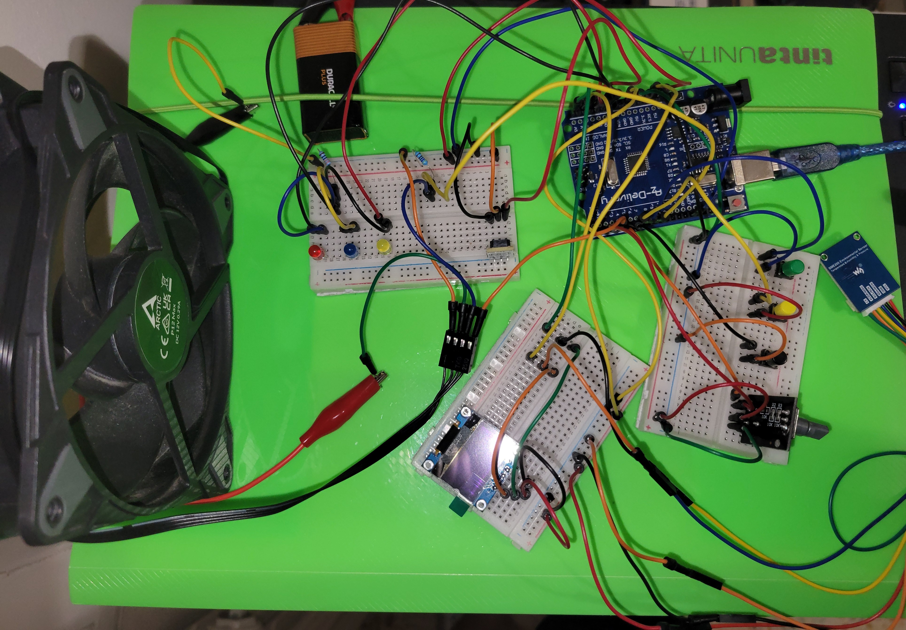

# Bare-Metal AVR Smart Fan Controller

[](https://github.com/EngineerPatrick/Bare-Metal-AVR-Smart-Fan-Controller/actions/workflows/CI.yml)

## Demo



[Watch the project demo video on LinkedIn](https://www.linkedin.com/feed/update/urn:li:activity:7471161384559448064/)

Demonstration video showing the advanced configuration of the fan-curve, real-time sensor-actuator operations and missing battery fault handling.

## Summary

A bare-metal project in Embedded C for the ATmega328P microcontroller on the Arduino Uno R3 board.

The user configures a fan-curve of 10 nodes containing temperature and speed values, then in the runtime loop the temperature is measured
with the BME280, the corresponding target speed is computed and the fan is driven with a PWM signal to match the target speed using feedback.

## Features

- Resource-constrained firmware
- Thread-safe interrupts with non-blocking ISR
- Scheduler service for real-time sensor-actuator coordination
- Aggressive error checks with error propagation
- TWI/I2C driver with state machine
- PWM fan driver with feedback controller
- EEPROM storage with CRC-16 validation
- GPIO/display UI with software-debounce
- Doxygen documentation for all APIs

## Hardware

- ATmega328P / Arduino Uno R3
- BME280 I2C sensor
- SSD1306 0.96" OLED display
- 4-wire PWM fan
- 1 Rotary encoder
- 3 Push buttons
- 3 LEDs / 1 buzzer for fault indication

## Build Requirements

- `avr-gcc`
- `avr-libc` (2.2.1)
- `avr-objcopy`
- `avr-size`
- `avrdude`
- `make`
- `doxygen` optional, for documentation generation

## Quick Start

Build the firmware:

```bash
make
```

Flash the firmware using `avrdude`:

```bash
make flash
```

Remove build files and generated documentation:

```bash
make clean
```

Generate Doxygen documentation:

```bash
make docs
```

## UI Manual

The fan-curve can be configured only with constant or increasing speed values and increasing temperature values within the valid range.
```text
1. At startup the display shows 2 options to configure the fan-curve:
	- The standard option has 8 fixed temperature values and requires only the input of the speed
	- The advanced option requires the input of 10 temperature and speed values
2. The "select" button changes the selected option (blinking), the "confirm" button confirms the option and advances to the input phase
3. In the input phase, the rotary encoder changes the value of the selected digit (blinking), the "rate" button changes the selected digit
4. The "select" button changes from temperature to speed input (advanced mode only) and advances to the next node
5. The next node has the values of the preceding one (temperature is increased by 0.01°C) and can be set only with equal or higher values
6. If the "select" button is pressed when the last node is selected, the UI moves back to the first node
	- In this case, if one node is modified with higher values they get copied to all the successive nodes with lower values (temperature is increased by 0.01°C)
7. The "confirm" button saves the configuration and advances the firmware to the runtime loop
8. If the "confirm" button is pressed before configuring all the nodes, the remaining nodes will be copies of the last selected node
9. During the runtime loop, the "rate" button moves the UI back to the option selection phase (1)
10. At the option selection phase the "rate" button skips the input phase and advances to the runtime loop loading the fan-curve from EEPROM

- If an error with the display service occurs LED1 lights up and the display shows "Err 1"
- If an error with the fan_curve service occurs LED2 lights up and the display shows "Err 2"
- If an error with the bme280 driver occurs LED3 lights up and the display shows "Err 3"
- If an error with the fan driver occurs the buzzer emits a sound and the display shows "Err 4"
```

The README is also used as the Doxygen main page through:

```
USE_MDFILE_AS_MAINPAGE = README.md
```

## License

This project is licensed under the MIT License. See the `LICENSE` file for details.
